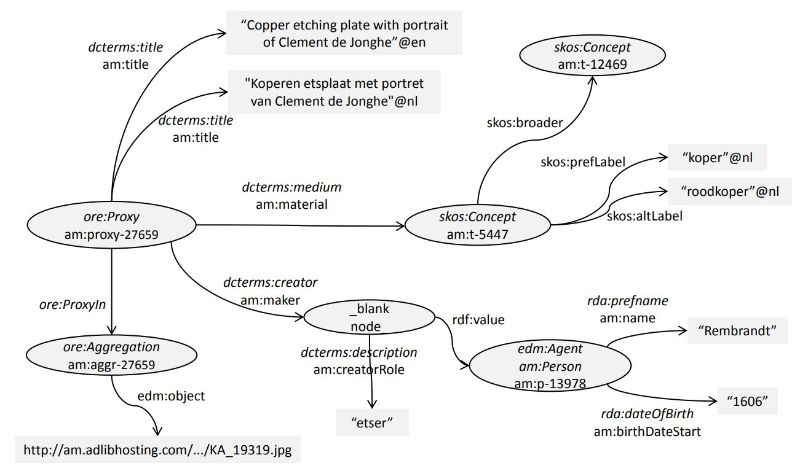

# Amsterdam Museum Linked Data

The Amsterdam Museum (https://www.amsterdammuseum.nl/) is a Dutch museum hosting objects related to the history and culture of Amsterdam and its citizens. Among
these objects are paintings, drawings, prints, glass and silver objects, furniture, books, costumes, etc. This repository contains an Linked Data version of the collection data converted from a snapshot in 2011. The data was retrieved from an XML-dump of the museum's Adlib collection database and then converted to RDF compliant with the Europeana Data Model (https://pro.europeana.eu/page/edm-documentation) (EDM). This makes the Amsterdam Museum data the first of its kind to be officially converted and made available in this format.

The results are more than 6.6 Million RDF triples describing all of the more than 70.000 cultural heritage objects related to the city of Amsterdam described by the museum.

In the past (2011), the data was available int the Europeana Semantic Layer, developed by the EuropeanaConnect project. At this point, the original data is provided as is through this git repository only. If you want to use it, load it into your favourite triple store. This data has been used as a benchmark dataset in multiple Linked Data research projects, including the kgbench repository benchmark (http://kgbench.info/).

If you use this data, please cite it as:

*Victor de Boer, Jan Wielemaker, Judith van Gent, Marijke Oosterbroek, Michiel Hildebrand, Antoine Isaac, Jacco van Ossenbruggen, Guus Schreiber (2013). Amsterdam Museum Linked Open Data. Semantic Web – Interoperability, Usability, Applicability, 4(3), 237–243..* 

More information can be found in [that dataset paper](https://www.semantic-web-journal.net/content/amsterdam-museum-linked-open-data).

## Content
The RDF data is found in the /rdf/ folder, wich three main named graphs (seen as RDF-turtle files) representing the three main sources of (meta)data: 
- am-data.ttl.gz: Object metadata graph containing 5,700,371 triples describing 73,447 objects (ore:Proxy instances)
- am-thesaurus.ttl: The museum's thesaurus graph containing 601,819 triples for 28,000 skos:Concepts 
- am-people.ttl: A Person authority list containing 301,143 triples describing 66,966 persons (edm:Agent instances) 
- Several schema files that contain RDFS ontologies for the Data and mappings to SKOS, RDA and other vocabularies
- A void.ttl file describing the metadata of the entire dataset.

## Data Model

This image shows small part of the RDF graph surrounding the resource am:proxy-27659. Predicates and classes are listed with their super-properties and super-classes in italics. On the left side, the relation to the Aggregation (with the attached thumbnail) can be seen. In the top right, the relation to the thesaurus concept is shown. In the bottom right, a complex creator relation (the relation has a type as well as a value) requires a blank node. The rdf:value of the blank node is a resource in the Person list. The proxy has two title triples, for the English and Dutch titles respectively, with language-typed literals as objects.
For more details, please consult https://www.semantic-web-journal.net/content/amsterdam-museum-linked-open-data.

## Example URIs

- http://purl.org/collections/nl/am/proxy-63432: Bovenlicht van voormalige apotheek Schrijnen, 'Aconitum Napellus' (Apothecary's Transom)
- http://purl.org/collections/nl/am/proxy-23182: Herdenkingsplaat eerste vlucht Amsterdam-Batavia (Plate commemorating the first Amsterdam-Batavia flight)
- http://purl.org/collections/nl/am/proxy-54832: Een protest-shirt afkomstig van de plek van de moordaanslag op Theo van Gogh (T-shirt found on Theo van Gogh's murder scene).
- http://purl.org/collections/nl/am/proxy-38596: Prent "De Grote Markt van Haarlem" (Print depicting Haarlem's market square).

## Example SPARQL queries

Two example queries:

Returns all objects with dc:subject "Delft": 
*SELECT ?object WHERE { ?object dc:subject ?concept . ?concept skos:prefLabel ?label . FILTER ( regex ( str(?label), "Delft") ) }*

Returns all objects made of gold: 
*SELECT ?object WHERE { ?object dcterms:medium?concept . ?concept skos:prefLabel ?label . FILTER ( regex ( str(?label), "goud")) }*

## Conversion process
The conversion into EDM was done a two-step process, using the [SWI-Prolog](http://swi-prolog.org) based XMLRDF conversion scripts (see also https://semanticweb.cs.vu.nl/xmlrdf/). In the first step, the XML is converted into 'basic RDF', every node in the XML tree gives rise to a RDF blank node, with attributes and sub-trees being mapped to property-subjects. In the second step, the basic RDF is converted to EDM-RDF, using XMLRDF rewrite rules. In this step, AHM records are converted to EDM Proxy/Aggregation/PhysicalThing triangle.

- The metadata describing the cultural heritage object is attached to the Proxy. Here you find information such as Title, Creator, Subject and Creation dates.
- The Aggregation is used to list the meta-metadata. This includes the creator of the proxy-metadata and other provenance information about the metadata. The Aggregation is also used to link to the data provider's (in this case AHM's) landing page and/or image thumbnails for the cultural heritage object.
- PhysicalThing is only used to established identity links between objects presented by varying data providers.
